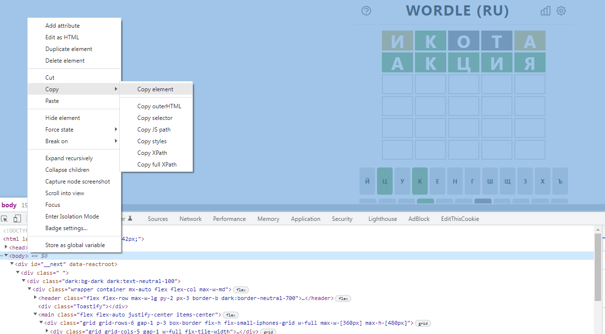

# wordle-helper
Проект для автоматизации решения головоломки wordle<br>

Синтаксис: python main.py <присутствующие буквы|?> <отсутствующие буквы|?> <regeg шаблон|.....>')<br>

Примеры:<br>
```sh
python main.py ? ? .....
python main.py орма иктпен .орма
python main.py та ико "...т[^а]"
```

При запуске без параметров 
```sh
python main.py 
```
есть возможность проанализировать буфер клавиатуры и если скрипт распознает верстку сайта https://wordle.belousov.one/
автоматически запустится с нужными параметрами<br>


Пример вывода
```cmd
Usage: python main.py <letters in word|?> <letters not in word|?> <template|.....>
Examples: python main.py ? ? .....
Examples: python main.py орма иктпен .орма
Examples: python main.py та ико "...т[^а]" 
Examples: python main.py
  For Clipboard mode
Found in clipboard:
python main.py кциая то акция
Word count after apply rules: 1
акция      | 0.26 
```
Данные для режима из буфера клавиатуры можно получить например в режиме разработчика в Chrome
